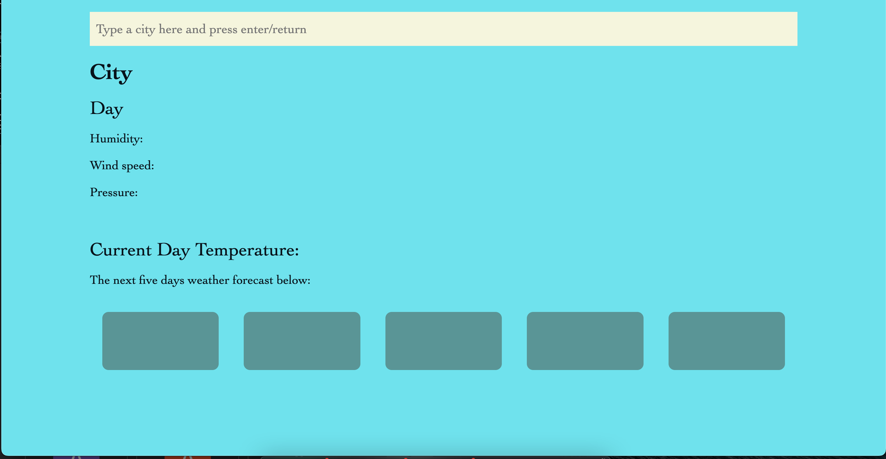
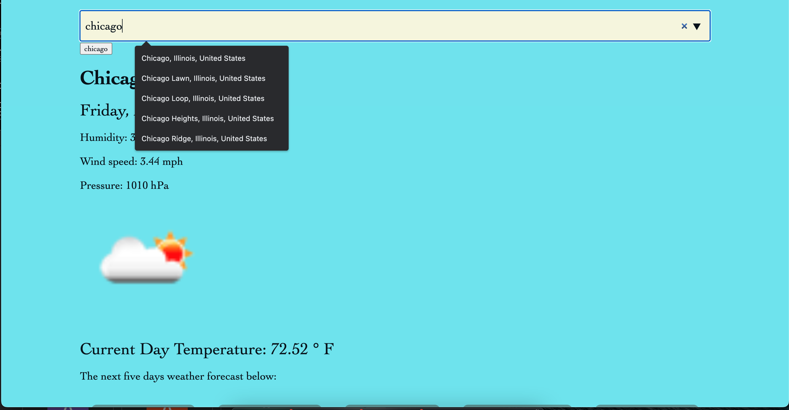
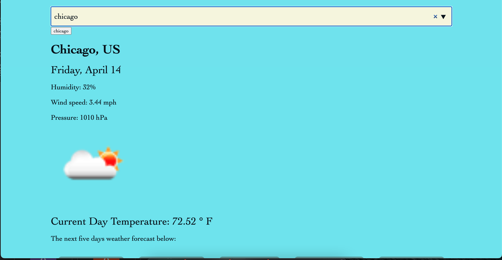
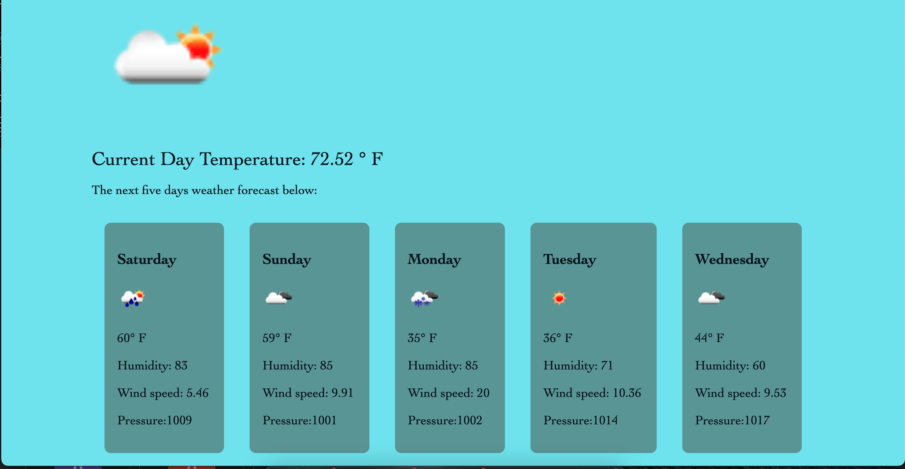

# Weather-dashboard

## Table of Contents

- [Description](#description)
- [Installation](#installation)
- [Usage](#usage)
- [Links](#links)

## Description

My goal & motivation is to build a weather dashboard application with form inputs utilizaing a third party API (OpenWeatherMap)  to generatate a five-day weather forecast that retrieves weather data for cities. I also utilized localStorage to store persistent data. 
Attached below are screenshots of my deployed weather dashboard website. 

## Installation

This page was accomplished with technologies such as Javascript, HTML & CSS. I also utilized teleport to generate dropdwon of cities to create a more user-friendly application which users can click on to find weather for cities instead of a submit button..

## Usage
 Usage of my weather dashboard application is done when a user is able to search for a city, and they are presented with current and future conditions for that city and that city is added to the search history. 
 Afterwards, users are presented with a 5-day forecast that displays the date, an icon representation of weather conditions, the temperature, the wind speed, and the humidity.

 ## Links

 Code link - https://github.com/Awele1111/Weather-dashboard
 
 Demo Link - https://awele1111.github.io/Weather-dashboard/